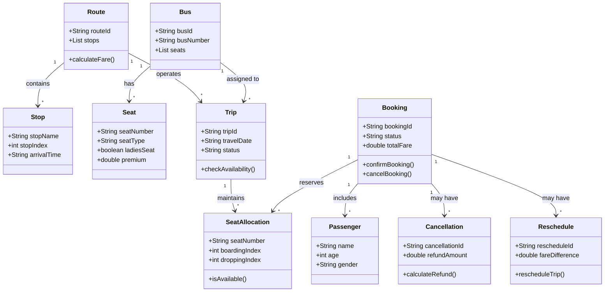

# Class Diagram – Bus Reservation System

```mermaid
classDiagram
    class Route {
        +String routeId
        +List stops
        +calculateFare()
    }

    class Stop {
        +String stopName
        +int stopIndex
        +String arrivalTime
    }

    class Bus {
        +String busId
        +String busNumber
        +List seats
    }

    class Seat {
        +String seatNumber
        +String seatType
        +boolean ladiesSeat
        +double premium
    }

    class Trip {
        +String tripId
        +String travelDate
        +String status
        +checkAvailability()
    }

    class Booking {
        +String bookingId
        +String status
        +double totalFare
        +confirmBooking()
        +cancelBooking()
    }

    class Passenger {
        +String name
        +int age
        +String gender
    }

    class SeatAllocation {
        +String seatNumber
        +int boardingIndex
        +int droppingIndex
        +isAvailable()
    }

    class Cancellation {
        +String cancellationId
        +double refundAmount
        +calculateRefund()
    }

    class Reschedule {
        +String rescheduleId
        +double fareDifference
        +rescheduleTrip()
    }

    Route "1" --> "*" Stop : contains
    Bus "1" --> "*" Seat : has
    Route "1" --> "*" Trip : operates
    Bus "1" --> "*" Trip : assigned to
    Trip "1" --> "*" SeatAllocation : maintains
    Booking "1" --> "*" Passenger : includes
    Booking "1" --> "*" SeatAllocation : reserves
    Booking "1" --> "*" Cancellation : may have
    Booking "1" --> "*" Reschedule : may have
```
