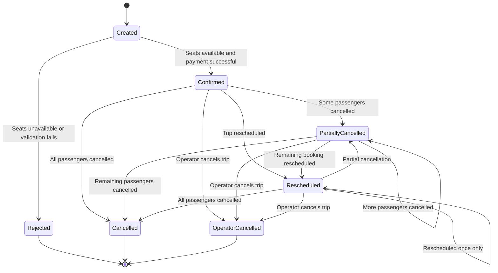

# State Diagram – Booking Lifecycle

```mermaid
stateDiagram-v2
    [*] --> Created

    Created --> Confirmed : Seats available and payment successful
    Created --> Rejected : Seats unavailable or validation fails

    Confirmed --> PartiallyCancelled : Some passengers cancelled
    Confirmed --> Cancelled : All passengers cancelled
    Confirmed --> Rescheduled : Trip rescheduled
    Confirmed --> OperatorCancelled : Operator cancels trip

    PartiallyCancelled --> PartiallyCancelled : More passengers cancelled
    PartiallyCancelled --> Cancelled : Remaining passengers cancelled
    PartiallyCancelled --> Rescheduled : Remaining booking rescheduled
    PartiallyCancelled --> OperatorCancelled : Operator cancels trip

    Rescheduled --> PartiallyCancelled : Partial cancellation
    Rescheduled --> Cancelled : All passengers cancelled
    Rescheduled --> Rescheduled : Rescheduled once only
    Rescheduled --> OperatorCancelled : Operator cancels trip

    Rejected --> [*]
    Cancelled --> [*]
    OperatorCancelled --> [*]
```
